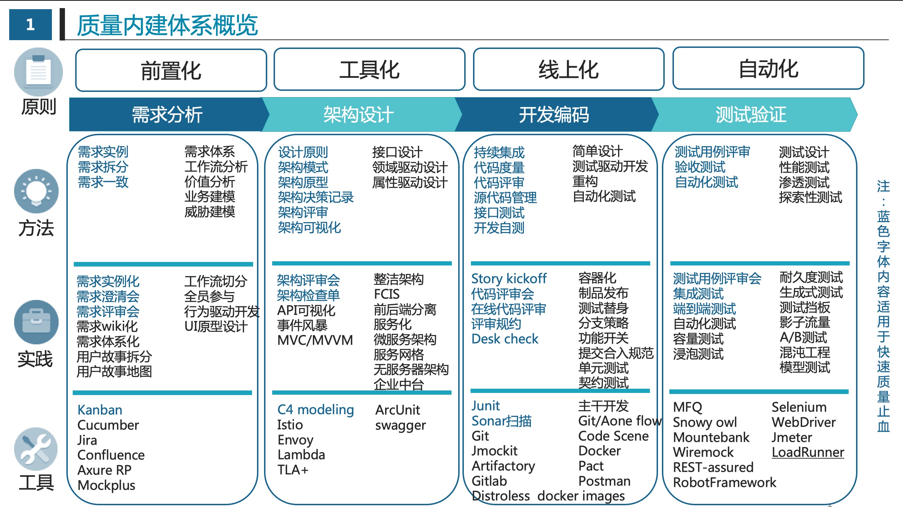

# 质量内建体系

## 质量内建体系概览

## 质量内建原则

### 前置化

### 工具化

### 线上化

### 自动化 

## 需求分析阶段

### 方法

### 实践

### 工具

## 架构设计阶段

### 方法

### 实践

### 工具

## 开发编码阶段

### 方法

### 实践

### 工具

## 测试验证阶段

### 方法
####测试用例评审
####验收测试
####自动化测试

### 实践

### 工具

